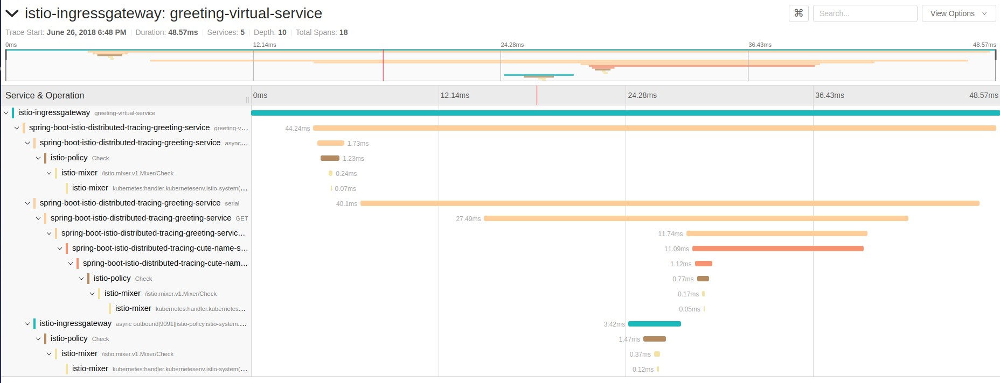

= Istio Distributed Tracing Mission

== Purpose
Showcase Istio's Distributed Tracing via a (minimally) instrumented set of Spring Boot applications

== Prerequisites
. Openshift 3.9 cluster
. Istio 0.7.1 with authentication installed on the aforementioned cluster. To install Istio simply follow one of the following docs:
.. https://istio.io/docs/setup/kubernetes/quick-start.html
.. https://istio.io/docs/setup/kubernetes/ansible-install.html
. Enable automatic sidecar injection for Istio (See https://istio.io/docs/setup/kubernetes/sidecar-injection.html[this] for details)
+
In order for Istio automatic sidecar injection to work properly, the following Istio configuration needs to be in place:
+
.. The `policy` field is set to `disabled` in the `istio-inject` configmap  of the `istio-system` namespace.
   This can be checked by inspecting the output of

   oc get configmap istio-inject -o jsonpath='{.data.config}' -n istio-system | grep policy

.. The `istio-sidecar-injector` `MutatingWebhookConfiguration` should not limit the injection to properly labeled namespaces,
   If Istio was installed using the default settings, then make sure the output of

   oc get MutatingWebhookConfiguration istio-sidecar-injector -o jsonpath='{.webhooks[0].namespaceSelector}' -n istio-system`
+
is empty. It is advised however that you inspect the output of

   oc get MutatingWebhookConfiguration istio-sidecar-injector -o yaml
+
to make sure that no other "filters" have been applied.

. Expose services and Istio ingress:
+
```
oc expose svc istio-ingress -n istio-system
```
. Login to the cluster with the admin user

== Environment preparation

Create a new project/namespace on the cluster. This is where your application will be deployed.

```bash
oc new-project <whatever valid project name you want>
```

== Build and deploy the application

=== With Fabric8 Maven Plugin (FMP)
Execute the following command to build the project and deploy it to OpenShift:
```bash
mvn clean package fabric8:deploy -Popenshift
```
Configuration for FMP may be found both in pom.xml and `src/main/fabric8` files/folders.

This configuration is used to define service names and deployments that control how pods are labeled/versioned on the OpenShift cluster. Labels and versions are key concepts for creating load-balanced or multi-versioned pods in a service.


=== With Source to Image build (S2I)
Run the following commands to apply and execute the OpenShift templates that will configure and deploy the applications:
```bash
    find . | grep openshiftio | grep application | xargs -n 1 oc apply -f

    oc new-app --template=spring-boot-istio-distributed-tracing-booster-greeting-service -p SOURCE_REPOSITORY_URL=https://github.com/snowdrop/spring-boot-istio-distributed-tracing-booster -p SOURCE_REPOSITORY_REF=master -p SOURCE_REPOSITORY_DIR=spring-boot-istio-distributed-tracing-greeting-service
    oc new-app --template=spring-boot-istio-distributed-tracing-booster-cute-name-service -p SOURCE_REPOSITORY_URL=https://github.com/snowdrop/spring-boot-istio-distributed-tracing-booster -p SOURCE_REPOSITORY_REF=master -p SOURCE_REPOSITORY_DIR=spring-boot-istio-distributed-tracing-cute-name-service
```

= Use Cases
== Configure an ingress Route to access the application
. Create a RouteRule to forward traffic from istio-ingress to the demo application
+
```bash
    oc create -f rules/route-rule-redir.yml
```
. Access the application
+
Run the following command to determine the appropriate URL to access our demo. Make sure you access the url with the HTTP scheme. HTTPS is NOT enabled by default:
+
```bash
echo http://$(oc get route istio-ingress -o jsonpath='{.spec.host}{"\n"}' -n istio-system)/greeting/
```
+
The result of the above command is the istio-system istio-ingress URL, appended with the RouteRule path. Open this URL in your a web browser.
. Follow the instructions in the application UI

== View application traces
. Access the Jaeger tracing dashboard
+
The traces from the invocation of the two endpoints should look like the following:
+

+
Note that it could take a few seconds for all the spans to be collected and presented in a trace that matches the picture above


== Undeploy the application

=== With Fabric8 Maven Plugin (FMP)
```bash
mvn fabric8:undeploy
```

=== With Source to Image build (S2I)
```bash
oc delete all --all
oc delete ingress --all
find . | grep openshiftio | grep application | xargs -n 1 oc delete -f
```

=== Remove the namespace
This will delete the project from the OpenShift cluster
```bash
oc delete project <your project name>
```
