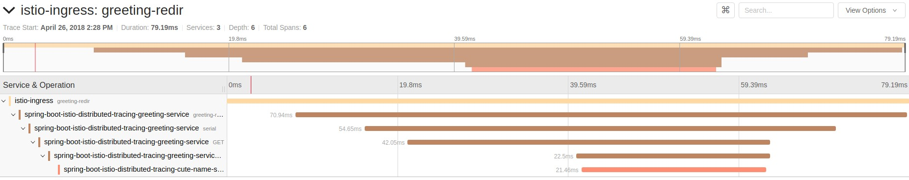

= Istio Distributed Tracing Mission
:icons: font
:toc: left
:toclevels: 2

== Purpose
Showcase Istio's Distributed Tracing via a (minimally) instrumented set of Spring Boot applications

== Prerequisites
. JDK 11+ installed with JAVA_HOME configured appropriately
. Openshift 4.12 cluster
. Istio installed on the aforementioned cluster using the link:https://docs.openshift.com/container-platform/4.12/service_mesh/v2x/installing-ossm.html[Red Hat OpenShift Service Mesh Operator].
. Login to the cluster with the *admin* user

[#environment-preparation]
== Environment preparation

Create a new project/namespace on the cluster. This is where your application will be deployed.

```bash
oc new-project <whatever valid project name you want>
```

Add the `<whatever valid project name you want>` project to the Istio member roll. More information in this link:https://docs.openshift.com/container-platform/4.12/service_mesh/v2x/ossm-create-mesh.html#ossm-about-adding-namespace_ossm-create-mesh[link].

== Build and deploy the application

=== With Dekorate:
Execute the following command to build the project and deploy it to OpenShift:
```bash
mvn clean verify -Popenshift -Ddekorate.deploy=true
```

This configuration is used to define service names and deployments that control how pods are labeled/versioned on the OpenShift cluster. Labels and versions are key concepts for creating load-balanced or multi-versioned pods in a service.

== Use Cases

=== Access the application via the Istio ingress-gateway
. Create a RouteRule to forward traffic from istio-ingress to the demo application
+
```bash
oc create -f rules/greeting-gateway.yml
```
. Access the application
+
Run the following command to determine the appropriate URL to access our demo. Make sure you access the url with the HTTP scheme. HTTPS is NOT enabled by default:
+
```bash
echo http://$(oc get route istio-ingressgateway -o jsonpath='{.spec.host}{"\n"}' -n istio-system)/greeting/
```
+
The result of the above command is the istio-system istio-ingress URL, appended with the RouteRule path. Open this URL in your a web browser.
. Follow the instructions in the application UI

=== View application traces
. Access the Jaeger tracing dashboard
+
The traces from the invocation of the two endpoints should look like the following:
+

+
Note that it could take a few seconds for all the spans to be collected and presented in a trace that matches the picture above


=== Undeploy the application

==== Remove the namespace
This will delete the project from the OpenShift cluster
```bash
oc delete project <your project name>
```

== Integration tests

To run integration tests, first follow the steps on the <<environment-preparation>> section to create and prepare a new namespace.

=== Remove Jaeger UI security

[CAUTION]
====
For the integration tests to work it is required that the Jaeger UI isn't secured by authentication, as it is in the default configuration.
====

[WARNING]
=====
Disabling security isn't the suggested configuration but it is required for the integration tests to work.
=====

By default, when installing the Red Hat OpenShift distributed tracing platform operator, it will install a Jaeger instance with the security enabled:

.Secured Jaeger UI configuration
[source,yaml]
----
  ingress:
    enabled: true
    openshift:
      htpasswdFile: /etc/proxy/htpasswd/auth
      sar: '{"namespace": "istio-system", "resource": "pods", "verb": "get"}'
    options: {}
    resources: {}
    security: oauth-proxy
----

Disabling security is accomplished by setting the `spec.ingress.security` on the Jaeger operator to `none`.

This can be done either by using the OpenShift console (`Installed operators > Red Hat OpenShift distributed tracing platform > Jaguer > Edit Jaeger`) or using the CLI.

[NOTE]
====
More information on the Jaeger configuration at the link:https://docs.openshift.com/container-platform/4.12/service_mesh/v2x/ossm-reference-jaeger.html[Jaeger configuration reference page].
====

To disable security execute the following CLI commands.

.Set the `istio-system` as the default project
[source,bash]
----
oc project istio-system
----

.Patch jaeger to disable console security
[source,bash]
----
oc patch jaeger jaeger --patch '{"spec":{"ingress":{"security": "none" }}}' --type=merge
----

The result should be:

[source]
----
jaeger.jaegertracing.io/jaeger patched
----

Which will result in the following configuration.

.Unsecured Jaeger UI configuration
[source,yaml]
----
  ingress:
    enabled: true
    options: {}
    resources: {}
    security: none
----

=== Execute the Integration Tests

After everything is set up run the following commands.

.Commands to execute the integration tests
[source,bash]
----
oc new-project <project-name>
mvn clean verify -pl spring-boot-istio-distributed-tracing-cute-name-service -Popenshift -Ddekorate.deploy=true
mvn clean verify -pl spring-boot-istio-distributed-tracing-greeting-service -Popenshift -Ddekorate.deploy=true
oc create -f rules/greeting-gateway.yml
mvn clean verify -pl tests -Popenshift-it
----
