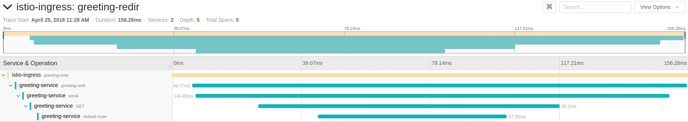

## Purpose 

Showcase Istio's Distributed Tracing via a (minimally) instrumented set of Spring Boot applications

## Prerequisites

- Openshift 3.9 cluster
- Istio 0.7.1 installed on the aforementioned cluster.
To install Istio simply follow one of the following docs:
    * https://istio.io/docs/setup/kubernetes/quick-start.html
    * https://istio.io/docs/setup/kubernetes/ansible-install.html
- Enable automatic sidecar injection for Istio
  * See [this](https://istio.io/docs/setup/kubernetes/sidecar-injection.html) for details
- Login to the cluster with the admin user
- Jaeger installed in the istio-system namespace

### Note on istiooc

The `istiooc cluster up --istio=true` command from [this](https://github.com/openshift-istio/origin/releases/) project 
perfectly satisfies aforementioned requirements  

## Environment preparation

```bash
    oc new-project demo-istio
```

**CAUTION**

In order for Istio automatic sidecar injection to work properly the following Istio configuration needs to be in place:
* The `policy` field is set to `disabled` in the `istio-inject` configmap  of the `istio-system` namespace
* The `istio-sidecar-injector` `MutatingWebhookConfiguration` should not limit the injection to properly labeled namespaces

The aforementioned configuration is not needed when the cluster has been setup using `istiooc`

## Deploy project

### Build using FMP

```bash
    mvn clean fabric8:deploy -Popenshift
```

### Build using s2i
```bash
    find . | grep openshiftio | grep application | xargs -n 1 oc apply -f

    oc new-app --template=spring-boot-istio-distributed-tracing-booster-greeting-service -p SOURCE_REPOSITORY_URL=https://github.com/snowdrop/spring-boot-istio-distributed-tracing-booster -p SOURCE_REPOSITORY_REF=master -p SOURCE_REPOSITORY_DIR=greeting-service
    oc new-app --template=spring-boot-istio-distributed-tracing-booster-cute-name-service -p SOURCE_REPOSITORY_URL=https://github.com/snowdrop/spring-boot-istio-distributed-tracing-booster -p SOURCE_REPOSITORY_REF=master -p SOURCE_REPOSITORY_DIR=cute-name-service
```

### Expose services

```bash
    oc expose svc istio-ingress -n istio-system
    oc create -f rules/route-rule-redir.yml
```

### Open the application

Open the URL given by the following command:

```bash
echo http://$(oc get route istio-ingress -o jsonpath='{.spec.host}{"\n"}' -n istio-system)/greeting/
```

The traces from the invocation of the two endpoints should look like the following:



Note that it could take a few seconds for all the spans to be collected and presented in a trace
that matches the picture above