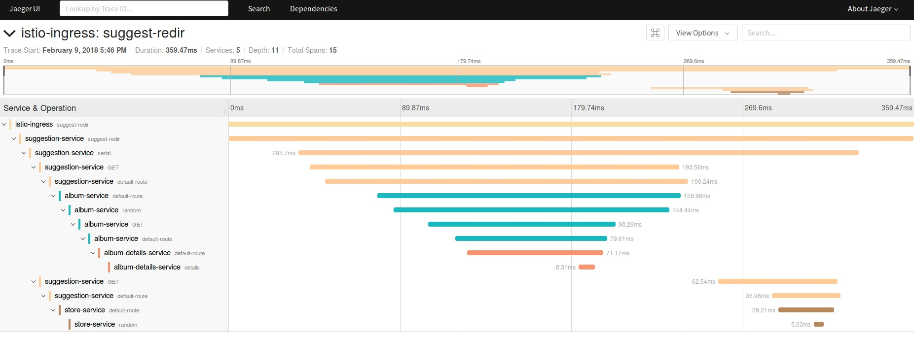
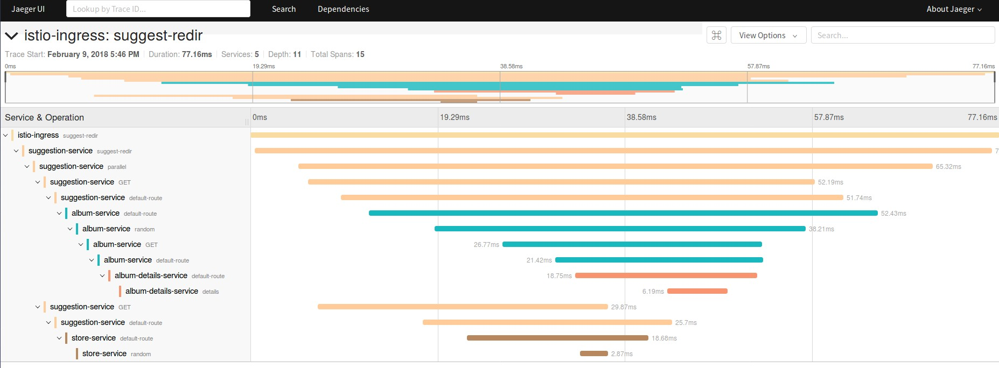

## Purpose 

Showcase Istio's Distributed Tracing capabilities with a set of properly instrumented Spring Boot applications

## Deploy on Minishift

```bash
    $ oc new-project demo-istio
    $ oc adm policy add-scc-to-user privileged -z default -n demo-istio
    $ mvn clean package fabric8:deploy -Pistio-openshift
    $ oc expose svc istio-ingress -n istio-system
    $ oc create -f rules/route-rule-redir.yml    
    $ open $(minishift openshift service istio-ingress -n istio-system --url)/suggest/
```

The traces from the invocation of the two endpoints should look like the following:

* Serial


* Parallel
